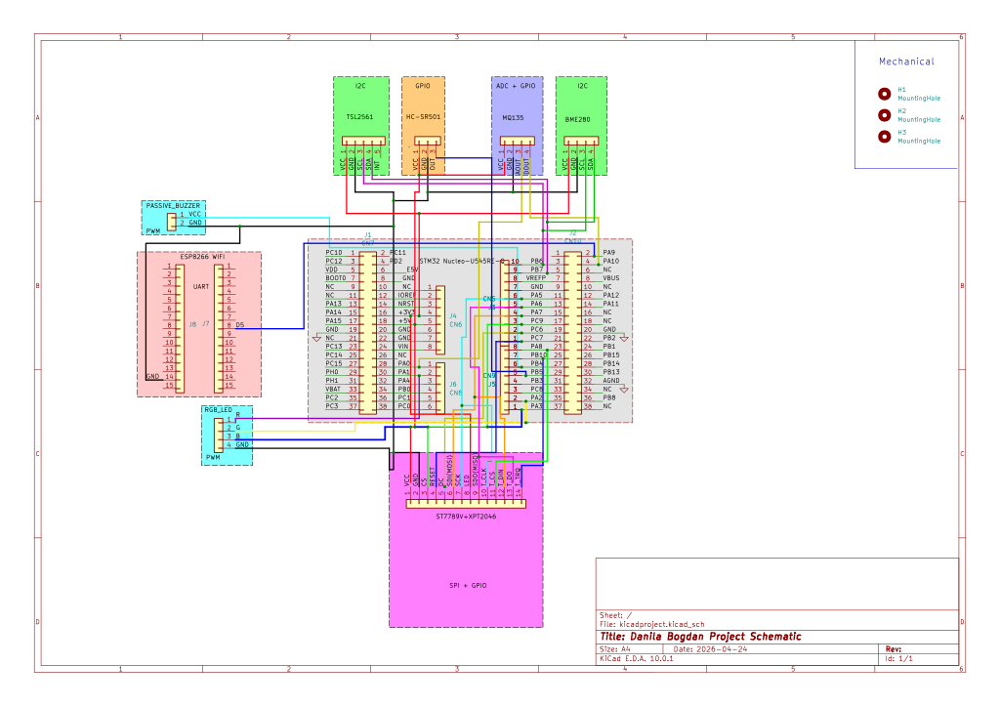

# Home Environment Station
A touchscreen dashboard that monitors temperature, humidity, light and air quality in real time

:::info 

**Author**: Bogdan Danila \
**GitHub Project Link**: https://github.com/UPB-PMRust-Students/project-2026-bgdanila-1

:::

## Description

The Home Environment Station is built around an STM32 Nucleo-U545RE-Q that reads data from multiple sensors: BME280 for temperature and humidity, TSL2561 for ambient light, MQ135 for air quality, and HC-SR501 for motion. Everything is shown on a 2.4" TFT LCD touchscreen where you can swipe between sensor pages. Values are color-coded green (optimal), orange (caution) or red (critical) so you can tell at a glance if something is off. An ESP8266 handles WiFi for remote logging, and a buzzer + RGB LED give alerts when things go out of range.

## Motivation

I wanted to build something that actually uses all the protocols we learned (SPI, I2C, ADC, PWM) together in one project, and have a nice UI on top of it. Air quality is something that affects you every day but you never really see the numbers. This project let me combine that practical idea with learning Embassy async, writing display drivers from scratch, and figuring out touch input on a real board.

## Architecture 

The STM32 talks to everything through different interfaces:

- **SPI Bus (shared)**: the ST7789 display and XPT2046 touch controller both sit on SPI1. Display runs at 20 MHz, touch at 1 MHz, switched via software chip selects.
- **I2C Bus**: BME280 (temperature + humidity) and TSL2561 (light) share the same I2C bus with different addresses.
- **ADC**: MQ135 air quality sensor gives an analog voltage that gets read through the STM32's ADC.
- **PWM**: drives the buzzer and RGB LED for alerts.
- **GPIO**: HC-SR501 PIR sensor outputs a digital high when it detects motion.
- **UART**: ESP8266 WiFi module for sending data remotely.

The firmware uses Embassy's async executor. The main loop polls touch input, detects swipe gestures, and handles page transitions. Sensor tasks will run concurrently and update shared state.

**Component Connections:**

| Component | Interface | STM32 Pins |
|-----------|-----------|------------|
| ST7789 Display | SPI1 (20 MHz) | MOSI: PA7 (D11), SCK: PA5 (D13), MISO: PA6 (D12), CS: PC9 (D10), DC: PC6 (D9), RST: PC7 (D8), LED: 3V3 |
| XPT2046 Touch | SPI1 (1 MHz, shared) | T_CLK: PA5 (D13), T_DIN: PA7 (D11), T_DO: PA6 (D12), T_CS: PA8 (D7), T_IRQ: PB10 (D6) |
| BME280 Sensor | I2C1 (shared) | SCL: PB6 (D15), SDA: PB7 (D14), VCC: 3V3 |
| TSL2561 Sensor | I2C1 (shared) | SCL: PB6 (D15), SDA: PB7 (D14), INT: not connected |
| MQ135 Sensor | ADC1 + GPIO | AOUT: PA0 (A0), DOUT: PA10 (D2), VCC: 5V |
| HC-SR501 PIR | GPIO input | OUT: PB5 (D4), VCC: 5V |
| ESP8266 WiFi (NodeMCU) | USART1 TX (one-way) | STM32 PA9 (TX) -> NodeMCU D5 (GPIO14 RX), common GND |
| Passive Buzzer | PWM (planned) | PB4 (D5), via series resistor to buzzer |
| RGB LED | PWM x3 (planned) | PA1 (A1), PA2 (D1), PA3 (D0), each color through resistor |

### System Schematic (Text)

```text
+---------------------+       +--------------------------------------+
| 5V / 3V3 / GND rails|------>| STM32 NUCLEO-U545RE-Q (central node) |
+---------------------+       +--------------------------------------+
                                      |
      +-------------------------------+-------------------------------+
      |               |               |               |               |
      v               v               v               v               v
+----------------+ +-------------+ +-------------+ +-------------+ +--------------+
| ST7789 +       | | BME280      | | TSL2561     | | MQ-135      | | HC-SR501 PIR |
| XPT2046 LCD    | | Temp/Hum/P  | | Light       | | Air quality | | Motion       |
| SPI1 + GPIO    | | I2C1        | | I2C1        | | ADC + GPIO  | | GPIO input   |
+----------------+ +-------------+ +-------------+ +-------------+ +--------------+
      |               |               |               |               |
      +---------------+---------------+---------------+---------------+
                                      |
                                      v
                          +----------------------+
                          | ESP8266 NodeMCU v0.1|
                          | UART RX + common GND|
                          +----------------------+
                                      |
                    +-----------------+-----------------+
                    |                                   |
                    v                                   v
           +-------------------+                +-------------------+
           | Passive buzzer    |                | RGB LED           |
           | PWM output (PB4)  |                | PWM R/G/B         |
           +-------------------+                +-------------------+

HARDWARE CONNECTIONS (pin-level):
  LCD+Touch: PA5/PA6/PA7, PC9, PC6, PC7, PA8, PB10
  BME280: PB6 (SCL), PB7 (SDA), 3V3, GND
  TSL2561: PB6 (SCL), PB7 (SDA), 3V3, GND
  MQ-135: PA0 (AOUT), PA10 (DOUT), 5V, GND
  PIR: PB5 (OUT), 5V, GND
  ESP8266: PA9 (USART1_TX) -> D5 (GPIO14 RX), GND <-> GND
  Buzzer (planned): PB4 (PWM) -> buzzer +
  RGB LED (planned): PA1/PA2/PA3 (PWM) -> R/G/B
```

## Log

# Week 2 - 4

Documentation for both software and hardware part of the project. Set up the Rust embedded toolchain and prepared the STM32 workflow.

# Week 5 - 6

Ordered all the hardware. Soldered the TSL2561 sensor and the MQ135 sensor. Debugged the STM32 Nucleo-U545RE-Q and prepared it for the project.

# Week 7

Connected the ST7789 display to the STM32 Nucleo-U545RE-Q. Sorted out visual and touchscreen parts. Tweaked the UI and swipe animations with static values before adding all sensors.

# Week 8

Integrated BME280, TSL2561, and PIR into the runtime UI, then added the ESP8266 NodeMCU web dashboard path over UART JSON streaming.

# Week 9

Improved refresh responsiveness and synchronized motion behavior between board display and web dashboard. Finalized project documentation updates and KiCad schematic integration.

## Hardware

The core is an STM32 Nucleo-U545RE-Q running at 160 MHz (PLL from HSI). The display is a 2.4" TFT with an ST7789V controller and XPT2046 resistive touch, both sharing SPI1 with separate chip selects. For sensors I'm using a BME280 (temp + humidity over I2C), TSL2561 (light over I2C), MQ135 (air quality, analog), and HC-SR501 (PIR motion, digital GPIO). An ESP8266 NodeMCU handles WiFi over UART. Alerts come from a passive buzzer and an RGB LED, both driven by PWM. All the small stuff (breadboard, wires, resistors, LEDs) came from a component kit.

### Schematics



### Bill of Materials

| Device | Usage | Price |
|--------|--------|-------|
| [STM32 Nucleo-U545RE-Q](https://www.st.com/en/evaluation-tools/nucleo-u545re-q.html) | The microcontroller | [125 RON](https://ro.mouser.com/ProductDetail/STMicroelectronics/NUCLEO-U545RE-Q?qs=tlsG%2FOw5FFjl20PI4ypAag%3D%3D) |
| [2.4" TFT LCD Touchscreen (ST7789V + XPT2046)](https://www.emag.ro/display-tft-spi-2-4-inch-240x320-lcd-cu-touchscreen-driver-st7789v-arduino-emg178/pd/DXZMBSYBM/) | Display + touch for the dashboard UI | [54.86 RON](https://www.emag.ro/display-tft-spi-2-4-inch-240x320-lcd-cu-touchscreen-driver-st7789v-arduino-emg178/pd/DXZMBSYBM/) |
| [Set 3x BME280](https://www.emag.ro/set-3x-senzor-temperatura-si-umiditate-presiune-atmosferica-bme280-modul-digital-i2c-spi-3-3v-5v-compatibil-arduino-si-raspberry-pi-pentru-statie-meteo-diy-et000011/pd/DNBHJ53BM/) | Temperature, humidity, pressure (I2C) | [76.74 RON](https://www.emag.ro/set-3x-senzor-temperatura-si-umiditate-presiune-atmosferica-bme280-modul-digital-i2c-spi-3-3v-5v-compatibil-arduino-si-raspberry-pi-pentru-statie-meteo-diy-et000011/pd/DNBHJ53BM/) |
| [TSL2561 (GY-2561)](https://www.emag.ro/modul-senzor-de-luminozitate-tsl2561-0-1-40k-lux-3v-0-6ma-gy-2561-dh000007/pd/DJ8QQL3BM/) | Light sensor, 0.1 to 40k+ lux (I2C) | [29.84 RON](https://www.emag.ro/modul-senzor-de-luminozitate-tsl2561-0-1-40k-lux-3v-0-6ma-gy-2561-dh000007/pd/DJ8QQL3BM/) |
| [MQ-135](https://www.emag.ro/modul-senzor-de-calitate-a-aerului-mq-135-calitate-a-aerului-detectie-co2-amoniac-fum-benzen-iesire-digitala-si-analogica-30-mm-x-20-mm-albastru-au4/pd/DR2G1QYBM/) | Air quality, detects CO2/NH3/benzene (analog) | [28.62 RON](https://www.emag.ro/modul-senzor-de-calitate-a-aerului-mq-135-calitate-a-aerului-detectie-co2-amoniac-fum-benzen-iesire-digitala-si-analogica-30-mm-x-20-mm-albastru-au4/pd/DR2G1QYBM/) |
| [HC-SR501 PIR](https://www.emag.ro/detector-de-miscare-hc-sr501-pir-compatibil-cu-arduino-infrarosu-33-mm-x-25-mm-x-25-mm-verde-d1/pd/D52G1QYBM/) | Motion detection | [23.27 RON](https://www.emag.ro/detector-de-miscare-hc-sr501-pir-compatibil-cu-arduino-infrarosu-33-mm-x-25-mm-x-25-mm-verde-d1/pd/D52G1QYBM/) |
| [ESP8266 NodeMCU V3](https://www.emag.ro/modul-esp8266-wifi-usb-c-30pin-nodemcu-v3-arduino-ch340-suport-pentru-esp32-alimentare-5v-12v-64kb-sram-4mb-flash-wifi-802-11-b-g-n-securitate-wpa-wpa2-11-porturi-i-o-1-port-analogic-compatibil-pentru/pd/D9DHMQYBM/) | WiFi for remote logging | [39.14 RON](https://www.emag.ro/modul-esp8266-wifi-usb-c-30pin-nodemcu-v3-arduino-ch340-suport-pentru-esp32-alimentare-5v-12v-64kb-sram-4mb-flash-wifi-802-11-b-g-n-securitate-wpa-wpa2-11-porturi-i-o-1-port-analogic-compatibil-pentru/pd/D9DHMQYBM/) |
| [Electronics Kit (Duueyct)](https://www.emag.ro/set-componente-electronice-duueyct-breadboard-830-puncte-rezistenta-de-lunga-durata-usor-de-manevrat-cu-cutie-de-depozitare-perfect-de-transportat-compatibil-arduino-uno-r3-si-raspberry-pi-multicolor-/pd/D8KWPG3BM/) | Breadboard, wires, resistors, LEDs, buzzer | [65.50 RON](https://www.emag.ro/set-componente-electronice-duueyct-breadboard-830-puncte-rezistenta-de-lunga-durata-usor-de-manevrat-cu-cutie-de-depozitare-perfect-de-transportat-compatibil-arduino-uno-r3-si-raspberry-pi-multicolor-/pd/D8KWPG3BM/) |
| **Total** | **Complete hardware cost** | **442.97 RON** |

## Software

| Library | Description | Usage |
|---------|-------------|-------|
| [embassy-stm32](https://github.com/embassy-rs/embassy) | Embassy HAL for STM32 | GPIO, SPI, I2C, ADC, PWM drivers |
| [embassy-executor](https://github.com/embassy-rs/embassy) | Async task executor | Runs sensor and UI tasks concurrently |
| [embassy-time](https://github.com/embassy-rs/embassy) | Timers and delays | Splash screen, polling intervals, debouncing |
| [embassy-sync](https://github.com/embassy-rs/embassy) | Sync primitives | Mutex for the shared SPI bus |
| [embassy-embedded-hal](https://github.com/embassy-rs/embassy) | Shared bus abstractions | SpiDeviceWithConfig for display/touch multiplexing |
| [mipidsi](https://github.com/almindor/mipidsi) | MIPI display driver | ST7789 init, orientation, color inversion |
| [embedded-graphics](https://github.com/embedded-graphics/embedded-graphics) | 2D graphics library | Text, shapes, dots on the dashboard |
| [embedded-hal](https://github.com/rust-embedded/embedded-hal) | HAL traits | SpiDevice for XPT2046 touch transfers |
| [defmt](https://github.com/knurling-rs/defmt) | Logging framework | Debug output over RTT |
| [panic-probe](https://github.com/knurling-rs/defmt) | Panic handler | Shows panics via probe-rs |
| [cortex-m](https://github.com/rust-embedded/cortex-m) | Cortex-M support | Critical sections, inline asm |


## Links

1. [Embassy async framework](https://embassy.dev/)
2. [Embedded Rust 101 course labs](https://embedded-rust-101.wyliodrin.com/docs/fils_en/lab/01)
3. [mipidsi docs](https://docs.rs/mipidsi/latest/mipidsi/)
4. [embedded-graphics docs](https://docs.rs/embedded-graphics/latest/embedded_graphics/)
5. [Nucleo-U545RE-Q user manual](https://www.st.com/resource/en/user_manual/um3062-stm32u5-nucleo64-board-mb1841-stmicroelectronics.pdf)
6. [BME280 datasheet](https://www.bosch-sensortec.com/media/boschsensortec/downloads/datasheets/bst-bme280-ds002.pdf)
7. [TSL2561 datasheet](https://ams.com/documents/20143/36005/TSL2561_DS000110_3-00.pdf)
8. 
